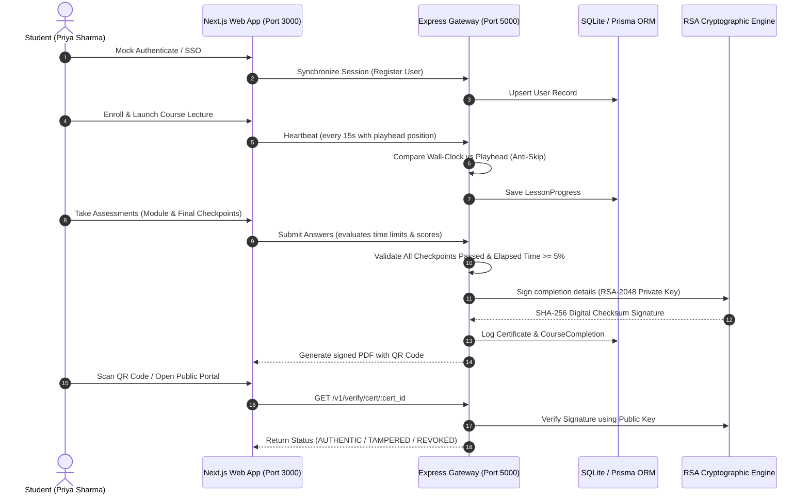

# 🌟 Kiri AI Learning Platform

Kiri AI is a professional, secure educational platform engineered to deliver premium courses and verify student certifications. The system guarantees academic integrity using **wall-clock pacing anti-fraud filters** and **cryptographically verifiable signatures**.

---

## 🗺️ System Architecture & Data Flow

Below is the verification flow showing how a user signs in, progresses through a course, undergoes security evaluation, and obtains an RSA-signed PDF credential:



---

## 🛠️ Technology Stack & Environment

### Frontend Architecture
*   **Core**: Next.js 16 (App Router) & React 19.
*   **Styling**: Tailwind CSS & global CSS transitions (Navy background `#0B0F19`, Amber Gold `#F59E0B`).
*   **Libraries**: `lucide-react` for graphics, `canvas-confetti` for completion celebrations.

### Backend Services
*   **Framework**: Express.js & TypeScript wrapper (`ts-node-dev`).
*   **Database**: Prisma Client with SQLite engine.
*   **Libraries**: `jsonwebtoken` (session handling), `pdfkit` (vector-based PDF layout), `qrcode` (verification links generator).

### Environment Configuration
Create a `.env` file inside the `backend/` directory:
```env
PORT=5000
DATABASE_URL="file:./dev.db"
JWT_SECRET="kiri-ai-learning-local-dev-jwt-secret-key-32-chars-long"
FIREBASE_PROJECT_ID="kiri-app-development"
```

---

## 🚀 Step-by-Step Developer Setup

### 1. Initialize & Start API Server
```bash
# Navigate and configure database
cd backend
npm install
npx prisma generate
npx prisma db push

# Populate courses, lessons, and exam items
npx prisma db seed

# Run the API server in developer mode (with auto-reload)
npm run dev
```
*The server will run on: **`http://localhost:5000`***

### 2. Launch Client Interface
```bash
# Navigate and install packages
cd ../frontend
npm install

# Run the Next.js web client
npm run dev
```
*The web client will launch on: **`http://localhost:3000`***

---

## 🔑 Mock Developer & Tester Accounts

For offline staging, you can authenticate using the following credential buttons in the navigation bar:

| Role | Username / Display Name | Mock Token ID |
| :--- | :--- | :--- |
| **Student** | Priya Sharma | `firebase-mock-student-uid-123` |
| **Educator** | Dr. Ramesh Kumar | `firebase-mock-instructor-uid-123` |

*To inspect an already verified public profile without taking a quiz, use Certificate ID: **`KIRI-2026-MOCKDEMO`***

---

## 📡 Core API Gateway Directory

### 🔐 Session Router
*   `POST /v1/auth/login`: Accepts JWT bearer tokens from Firebase and syncs user profiles.
*   `POST /v1/auth/mock-login`: Helper for offline testing (roles: `student`, `instructor`).

### 📚 Course Registry
*   `GET /v1/courses`: Returns all published catalogs with sponsors.
*   `GET /v1/courses/:slug`: Retrieves curriculum, modules, lessons, and user enrollment statuses.
*   `POST /v1/courses/:id/enroll`: Enrolls the authenticated user in the course.

### 🎥 Progress heartbeats
*   `POST /v1/lessons/:id/start`: Registers the beginning of a lesson.
*   `POST /v1/lessons/:id/heartbeat`: Sends current watch playhead. Caps time additions if user skips forward to prevent skipping.
*   `POST /v1/lessons/:id/complete`: Marks lesson as done if watched $\ge 80\%$ (videos) or read (articles).

### 📝 Assessment Engine
*   `GET /v1/quizzes/:id`: Returns quiz metadata and questions (excludes answers for anti-cheating protection).
*   `POST /v1/quizzes/:id/start`: Creates a quiz attempt session with an expiration timestamp.
*   `POST /v1/quizzes/:id/submit`: Scores responses. Exceeding the duration limit yields $0\%$.

### 🎓 Certificate Verification
*   `GET /v1/verify/cert/:cert_id`: Validates certificate details and cross-references cryptographic checksum signature using public keys.

---

## 🛡️ Academic Integrity Safeguards

1. **Anti-Skipping filter**: Playhead advancements exceeding wall-clock intervals are rejected.
2. **Sequential Checkpoints**: Completing a course requires passing every module quiz in the syllabus.
3. **Minimum Course Duration**: Flagged if total elapsed time since enrollment is less than 5% of course length.
4. **RSA Verification**: Verification uses asymmetric keys, preventing attackers from forged URLs.

---

## 📚 Code References

*   [Database Models](file:///d:/Kiri-Ai-Learning/backend/prisma/schema.prisma)
*   [Anti-Skip heartbeats controller](file:///d:/Kiri-Ai-Learning/backend/src/controllers/lesson.controller.ts)
*   [RSA Digital Signer Service](file:///d:/Kiri-Ai-Learning/backend/src/services/crypto.service.ts)
*   [Certificate Generation Service](file:///d:/Kiri-Ai-Learning/backend/src/services/certificate.service.ts)

---

## ☁️ Vercel One-Click Hosting Configuration

The Kiri AI backend is fully configured for deployment as a Vercel Serverless Function.

### Step-by-Step Vercel Deployment

1.  **Import to GitHub**: Push your local `Kiri-Ai-Learning` repository to GitHub.
2.  **Create Vercel Project**:
    *   Log into [Vercel Dashboard](https://vercel.com).
    *   Click **Add New** > **Project** and select your repository.
3.  **Configure Directory Settings**:
    *   Set **Root Directory** to `backend`.
    *   Keep build settings default (Vercel will auto-detect dependencies and run `postinstall` to compile Prisma client).
4.  **Set Environment Variables**:
    Add the following environment variables in Vercel settings:
    *   `DATABASE_URL`: `file:./dev.db` (Uses the bundled SQLite database with pre-seeded jobs, courses, and certificates).
    *   `JWT_SECRET`: A secure random 32-character string.
    *   `FIREBASE_PROJECT_ID`: `kiri-app-development` (or your active Firebase ID).
5.  **Deploy**: Click the **Deploy** button. Vercel will build the serverless functions and serve the backend API globally.

