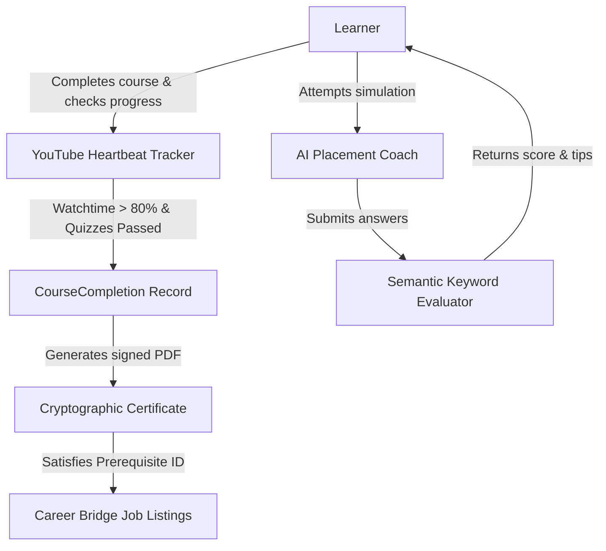

# Kiri AI Learning Ecosystem - Employability Bridge & AI Coach

We have successfully integrated career-bridge features and an interactive AI interview coaching simulator into the **Kiri AI Learning Platform**. Below is a summary of the architecture, features, and verification.

---

## 1. Feature Architecture

---

## 2. API Endpoints Registered

All endpoints are configured with JWT authentication middleware (`requireAuth` or `optionalAuth` as needed):

*   **`GET /api/jobs`**: Retrieves job listings, user-applied IDs, and course certificates earned by the active student.
*   **`POST /api/jobs/:id/apply`**: Validates certificate requirements and logs an application for the job.
*   **`GET /api/certificates/:id/download`**: Dynamically serves the signed verification PDF.
*   **`GET /api/verify/cert/:id`**: Cryptographic verify portal verifying SHA-256 signatures.

---

## 3. UI/UX Interface Enhancements

*   **Navy & Amber Gold theme** consistent styling throughout all dashboards and simulator interfaces.
*   **Three interactive tabs** under `/dashboard`:
    1.  **My Learning & Credentials**: Live course cards and PDF download/verification links.
    2.  **Career Bridge**: Clear badges for **Eligible**, **Applied**, and **Locked** jobs based on active credentials.
    3.  **AI Placement Coach**: Dynamic topic selection (GenAI or Placement Prep), an interactive, step-by-step chat interface, and a job readiness rating circular scorecard.

---

## 4. E2E Browser Validation Demo

The automated browser subagent tested the login flow, checked the Career Bridge job status, and completed the mock interview session with a **92% (High Job-Ready)** score.

---

> [!NOTE]
> All TypeScript compiler checks passed with exit code 0 for both `/backend` and `/frontend`. Active development servers remain running in the background for manual evaluation.
